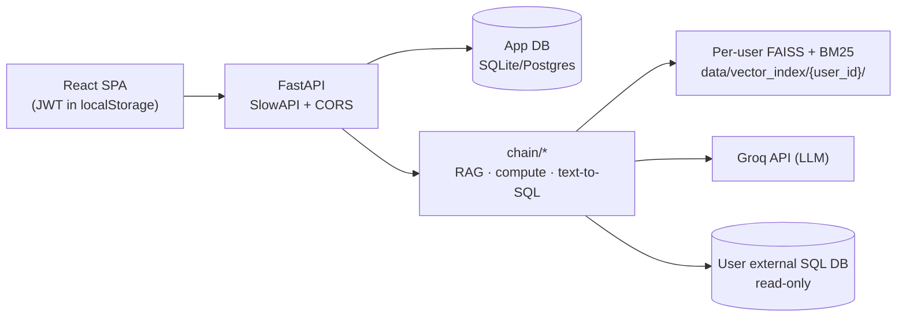

# ContextIQ

A per-user RAG system: upload your own documents (PDF, DOCX, CSV, TXT, Markdown) and ask questions with answers grounded in and cited back to the source file — plus connect an external SQL database and query it in plain English, read-only.

## What problem it solves

Two failure modes of naive retrieval-augmented generation:

1. **Pure vector search misses exact tokens** (IDs, codes, numbers). ContextIQ uses hybrid retrieval (FAISS semantic + BM25 keyword) so exact terms are still found — the eval below shows BM25-only misses exact-value questions the hybrid retriever recovers.
2. **Top-K retrieval answers structural/aggregate questions from a partial sample.** For CSV aggregates and whole-document questions, ContextIQ computes or reads the complete source directly instead of guessing from a few chunks.

## Features (as built)

- Hybrid retrieval — `EnsembleRetriever` (FAISS + BM25, weights 0.5/0.5).
- Cited answers — every document answer names its source file(s).
- Per-user isolation — separate FAISS/BM25 indexes and document storage per account.
- Exact CSV computation — aggregations (sum/mean/median/count/min/max/top-N/group-by) computed with pandas over the full file.
- Full-document analysis (DOCX/PDF/MD) — word/page count, heading lists, whole-document summaries and exhaustive extraction, with an explicit refusal above a 24k-char cap.
- Text-to-SQL — natural language → SQL against a connected Postgres/MySQL/SQLite database, over a read-only connection with a statement timeout and row cap.
- Section-aware chunking (DOCX/Markdown) and scanned-PDF detection (rejected at upload, no OCR).

## Tech stack

**Backend:** Python, FastAPI, SQLAlchemy (SQLite default; Postgres/MySQL supported), JWT (python-jose, passlib/bcrypt), slowapi, LangChain, FAISS (`faiss-cpu`), BM25 (`rank_bm25`), sentence-transformers, Groq, pandas, pypdf, python-docx, cryptography (Fernet).

**Frontend:** React 18 (Vite), Tailwind CSS, axios, react-router-dom, react-markdown.

Exact pinned versions: [docs/03-TECHNICAL-SPECIFICATION.md](docs/03-TECHNICAL-SPECIFICATION.md).

## Architecture



Details: [docs/04-ARCHITECTURE.md](docs/04-ARCHITECTURE.md).

## Quickstart

Prerequisites: Python 3.11+, Node 18+, a free [Groq API key](https://console.groq.com/keys).

**Backend**

```bash
cd backend
python3 -m venv venv && source venv/bin/activate     # Windows: venv\Scripts\activate
pip install -r requirements.txt
cp ../.env.example .env      # set SECRET_KEY, DB_ENCRYPTION_KEY, GROQ_API_KEY
uvicorn main:app --reload    # http://localhost:8000  (API docs at /docs)
```

Generate a `DB_ENCRYPTION_KEY`:

```bash
python -c "from cryptography.fernet import Fernet; print(Fernet.generate_key().decode())"
```

**Frontend**

```bash
cd frontend
npm install
cp .env.example .env         # VITE_API_BASE_URL defaults to http://localhost:8000
npm run dev                   # http://localhost:5173
```

**Tests**

```bash
pytest backend/tests/ -v      # 58 passing
```

Docker Compose and the (planned) hosted deployment: [docs/14-DEPLOYMENT.md](docs/14-DEPLOYMENT.md).

## Evaluation

Retrieval-only benchmark (`eval/`) — FAISS-only vs BM25-only vs Hybrid, K=4, 28 labeled questions.

| Metric | FAISS-only | BM25-only | Ensemble (Hybrid) |
|---|---|---|---|
| Precision@K | 25.0% | 22.3% | 25.0% |
| Recall@K | 100.0% | 89.3% | 100.0% |
| MRR | 0.964 | 0.869 | 0.893 |
| MAP | 0.964 | 0.869 | 0.893 |
| Latency p50 (ms) | 12.2 | 0.7 | 12.4 |

BM25-only misses three exact-value questions the hybrid retriever recovers (+12.0% recall vs BM25-only). A weight sweep (0.5–0.8 FAISS) showed no generalizable improvement over 0.5/0.5.

> **Caveat:** the corpus is a synthetic 10-document / ~17-chunk fixture. These numbers illustrate hybrid-vs-single-retriever behavior, **not** production-scale performance. See [docs/03-TECHNICAL-SPECIFICATION.md §7](docs/03-TECHNICAL-SPECIFICATION.md) and `eval/README.md`.

## Documentation

| # | Doc |
|---|---|
| 01 | [Product Requirements](docs/01-PRODUCT-REQUIREMENTS.md) |
| 02 | [Product Specification](docs/02-PRODUCT-SPECIFICATION.md) |
| 03 | [Technical Specification](docs/03-TECHNICAL-SPECIFICATION.md) |
| 04 | [Architecture](docs/04-ARCHITECTURE.md) |
| 05 | [Data Model](docs/05-DATA-MODEL.md) |
| 06 | [API Specification](docs/06-API-SPECIFICATION.md) |
| 07 | [Implementation Plan](docs/07-IMPLEMENTATION-PLAN.md) |
| 08 | [Roadmap](docs/08-ROADMAP.md) |
| 09 | [Decisions (ADRs)](docs/09-DECISIONS.md) |
| 10 | [Changelog](docs/10-CHANGELOG.md) |
| 11 | [Checkpoint](docs/11-CHECKPOINT.md) |
| 12 | [Testing](docs/12-TESTING.md) |
| 13 | [Security](docs/13-SECURITY.md) |
| 14 | [Deployment](docs/14-DEPLOYMENT.md) |
| 15 | [Contributing](docs/15-CONTRIBUTING.md) |
| 16 | [Style Guide](docs/16-STYLEGUIDE.md) |

Full factual inventory: [docs/PROJECT-AUDIT.md](docs/PROJECT-AUDIT.md).

## Current limitations

Honest, documented gaps (full list in [docs/13-SECURITY.md](docs/13-SECURITY.md) and [docs/08-ROADMAP.md](docs/08-ROADMAP.md)):

- No OCR — scanned/image PDFs are rejected at upload (not silently indexed empty).
- No PDF table extraction; DOCX page count deliberately not reported (no authoritative value).
- Database-query history is session-only; conversation titles use a client-side heuristic.
- Schema is created via `create_all` — no Alembic migrations yet.
- No CI; deployment to a hosting provider is planned, not implemented.
- Retrieval eval runs on a small synthetic corpus (see caveat above).
- Security: JWT is stored in `localStorage` (XSS trade-off); text-to-SQL validation is regex-level, backed by a read-only connection as the real write guard.

## Author

Emad Al-Qadah · qudahemad@yahoo.com · [github.com/3madQudah](https://github.com/3madQudah) · [linkedin.com/in/emadalqudah](https://www.linkedin.com/in/emadalqudah)
