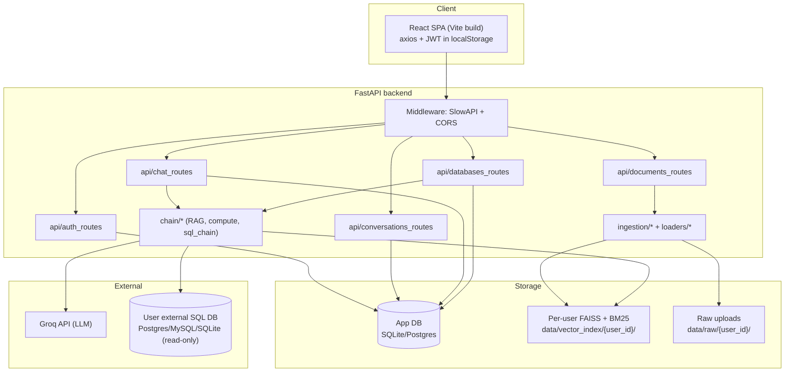
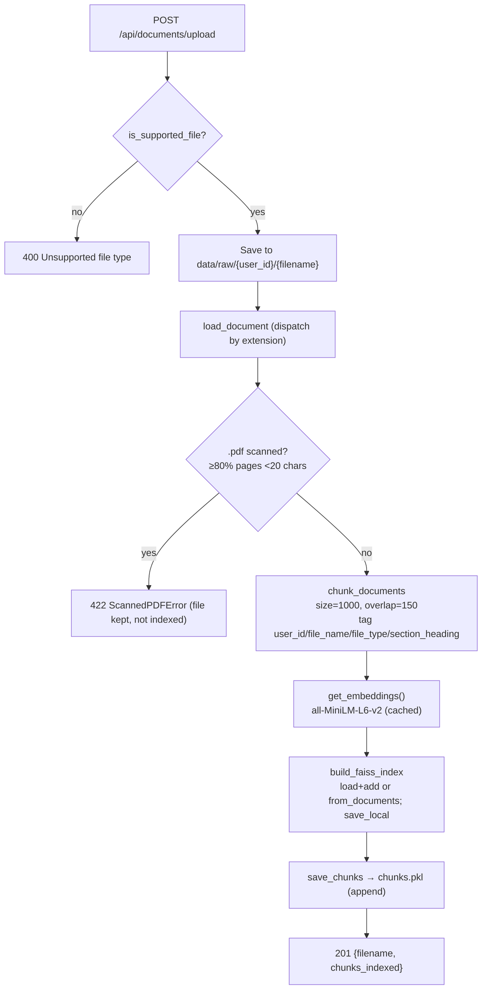
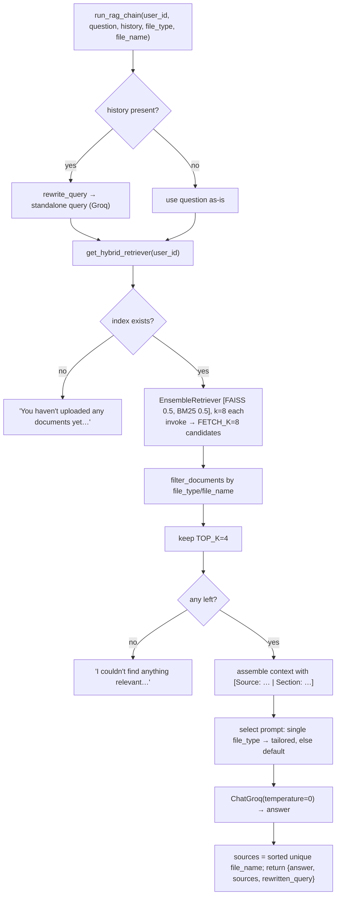
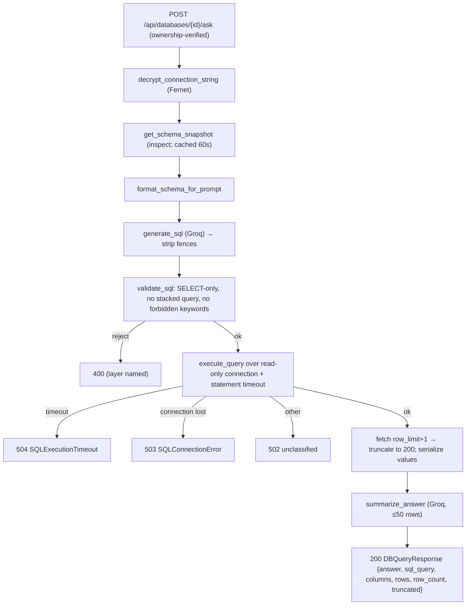

# 04 — Architecture

Source of truth: [PROJECT-AUDIT.md](PROJECT-AUDIT.md) §4, §6.4, §8, §14.3.

Related: [03 — Technical Specification](03-TECHNICAL-SPECIFICATION.md) · [05 — Data Model](05-DATA-MODEL.md) · [06 — API Specification](06-API-SPECIFICATION.md)

---

## 1. System overview

ContextIQ is a two-tier application: a React SPA (served statically) and a FastAPI backend. The backend owns an app database (SQLite/Postgres), per-user on-disk retrieval indexes (FAISS + BM25), and calls out to the Groq API for LLM inference and to user-provided external SQL databases for the text-to-SQL feature.



## 2. Application assembly & middleware order

On import, `main.py` (audit §4.1):

1. `load_dotenv()`.
2. Imports all ORM model modules (registers tables on the shared `Base.metadata`).
3. `Base.metadata.create_all(bind=engine)` — creates tables if missing (no migration tool; see [05 — Data Model](05-DATA-MODEL.md)).
4. Builds `FastAPI(title="ContextIQ")`, registers the slowapi limiter + `RateLimitExceeded` handler, adds `SlowAPIMiddleware`, then `CORSMiddleware` (`allow_origins=[FRONTEND_ORIGIN]`, credentials on, methods/headers `*`).
5. Mounts routers under `/api/auth`, `/api/documents`, `/api/chat`, `/api/conversations`, `/api/databases`; adds `GET /health`.

**Middleware** (audit §4.2): `SlowAPIMiddleware` (added first), then `CORSMiddleware`. There is **no custom auth middleware** — authentication is per-route via the `get_current_user` dependency. Auth rate limits are additionally applied per-route via `@limiter.limit(...)`.

There are **no** startup/shutdown event handlers beyond `create_all` at import time, and **no** background tasks, schedulers, or async jobs (audit §4.5).

## 3. Request lifecycle — `POST /api/chat/ask`

```mermaid
sequenceDiagram
  actor U as Browser (SPA)
  participant MW as SlowAPI + CORS
  participant H as chat_routes.ask
  participant Dep as get_current_user / get_db
  participant DB as App DB
  participant P as Routing (compute / full-doc / RAG)
  participant G as Groq API

  U->>MW: POST /api/chat/ask (Bearer JWT)
  MW->>Dep: resolve dependencies
  Dep->>DB: decode JWT, load User; open session
  Dep-->>H: current_user, db
  alt conversation_id is null
    H->>DB: create + commit Conversation
  else
    H->>DB: get_owned_conversation_by_id (404 if not owned)
  end
  H->>DB: persist user Message (committed before LLM call)
  H->>P: route question
  Note over P: 1) CSV compute if csv+computational<br/>2) full-doc if docx/pdf/md classifier fires<br/>3) else RAG
  P->>G: LLM call(s) (temperature=0)
  alt any exception
    H-->>U: 502 (user message kept, no fake assistant message)
  else success
    H->>DB: persist assistant Message + sources; bump updated_at; commit
    H-->>U: 200 ChatResponse (answer, sources, conversation_id, rewritten_query)
  end
```

## 4. Ingestion pipeline



Loaders (`loaders/document_loader.py`): PDF via `PyPDFLoader` + scan detection; DOCX/MD section-aware (`section_heading` metadata); TXT/CSV via LangChain community loaders. Delete path drops the file's chunks from `chunks.pkl` then **rebuilds** the FAISS index from the remaining chunks — O(remaining chunks) per delete (documented caveat, §7).

## 5. Retrieval / answering pipeline (RAG path)



Routing to CSV-compute or full-document paths happens **before** the RAG path in `chat_routes.ask` — see [02 — Product Specification §6](02-PRODUCT-SPECIFICATION.md).

## 6. Text-to-SQL pipeline



Read-only enforcement per DB type and error classification: [02 — Product Specification §8](02-PRODUCT-SPECIFICATION.md) and [13 — Security](13-SECURITY.md).

## 7. On-disk layout (non-relational state)

From audit §6.4:

```
backend/data/
├── raw/
│   └── {user_id}/
│       └── {original_filename}         # raw uploaded files, one dir per user
└── vector_index/
    └── {user_id}/
        ├── index.faiss                 # FAISS index (FAISS.save_local)
        ├── index.pkl                   # FAISS docstore/id map
        └── chunks.pkl                  # pickled LangChain Documents (backs BM25 + rebuild)
```

- `.gitkeep` files preserve the two directories; contents are gitignored.
- The only cache is in-process: the `sql_chain._schema_cache` (60s TTL, keyed by `connection_id`) and the embeddings singleton.
- FAISS `index.pkl` and `chunks.pkl` are loaded with `pickle` / `allow_dangerous_deserialization=True` — trusted as app-generated data (see [13 — Security](13-SECURITY.md)).
- Observed locally: an orphaned `vector_index/3/` exists with no matching `raw/3/` (audit §1.5).

## 8. Documented scaling caveats (audit §14.3)

| Caveat | Detail |
|---|---|
| No FAISS write locking | Per-user index is rebuilt on each write with no server-side lock; the frontend serializes uploads to avoid corruption. |
| O(N) document delete | Deleting one document re-embeds all remaining chunks for that user. |
| cwd-relative default DB path | `sqlite:///./contextiq.db` resolves relative to process cwd; docker-compose overrides it to a volume path to avoid data loss on rebuild. |
| Build-time API base URL | `VITE_API_BASE_URL` is compiled into the JS bundle; changing it requires a rebuild. |
| Single CORS origin | `FRONTEND_ORIGIN` allows exactly one origin. |

---

Author: Emad Al-Qadah · qudahemad@yahoo.com · [github.com/3madQudah](https://github.com/3madQudah) · [linkedin.com/in/emadalqudah](https://www.linkedin.com/in/emadalqudah)
