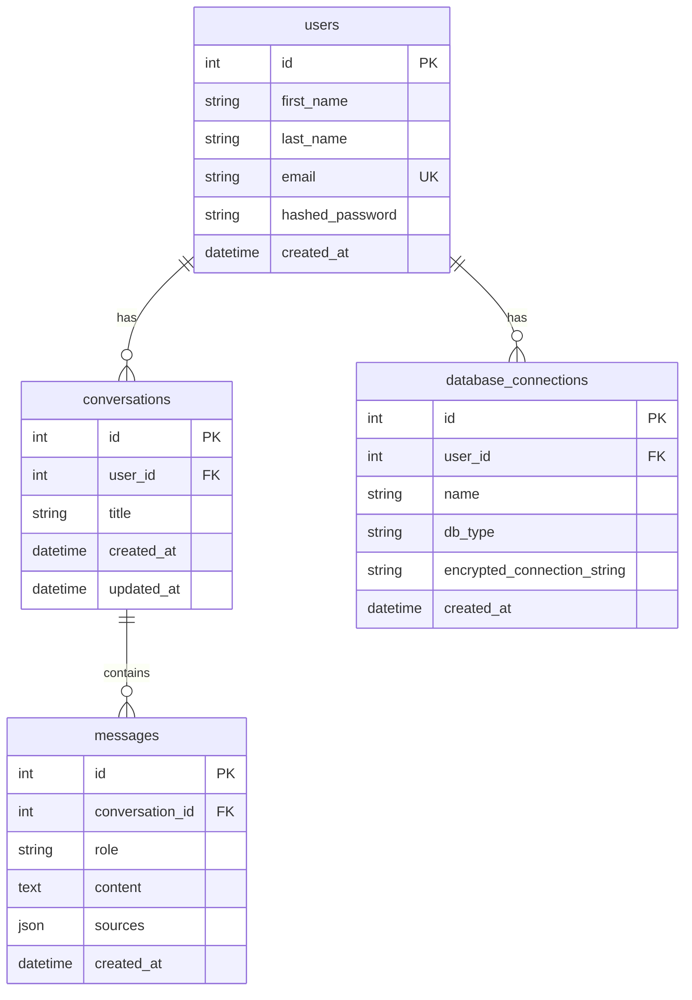

# 05 — Data Model

Source of truth: [PROJECT-AUDIT.md](PROJECT-AUDIT.md) §6.

Related: [04 — Architecture](04-ARCHITECTURE.md) · [06 — API Specification](06-API-SPECIFICATION.md)

---

## 1. ORM tables

SQLAlchemy declarative models sharing `Base` from `auth/database.py`. All models live in the `auth/` package.

### `users` — `auth/models.py::User`

| Column | Type | Nullable | Default | Unique | Index | FK |
|---|---|---|---|---|---|---|
| `id` | Integer | no | — | — | yes | PK |
| `first_name` | String | no | — | — | — | — |
| `last_name` | String | no | — | — | — | — |
| `email` | String | no | — | yes | yes | — |
| `hashed_password` | String | no | — | — | — | — |
| `created_at` | DateTime(timezone=True) | — | `now(utc)` | — | — | — |

Relationships: `conversations` (1→N, cascade all/delete-orphan), `database_connections` (1→N, cascade all/delete-orphan).

### `conversations` — `auth/chat_models.py::Conversation`

| Column | Type | Nullable | Default | Index | FK |
|---|---|---|---|---|---|
| `id` | Integer | no | — | yes | PK |
| `user_id` | Integer | no | — | yes | `users.id` ON DELETE CASCADE |
| `title` | String | no | — | — | — |
| `created_at` | DateTime(tz=True) | — | `now(utc)` | — | — |
| `updated_at` | DateTime(tz=True) | — | `now(utc)`, `onupdate=now(utc)` | — | — |

Relationships: `user` (N→1); `messages` (1→N, cascade all/delete-orphan, ordered by `Message.created_at`).

### `messages` — `auth/chat_models.py::Message`

| Column | Type | Nullable | Default | Index | FK |
|---|---|---|---|---|---|
| `id` | Integer | no | — | yes | PK |
| `conversation_id` | Integer | no | — | yes | `conversations.id` ON DELETE CASCADE |
| `role` | String | no | — | — | — |
| `content` | Text | no | — | — | — |
| `sources` | JSON | yes | — | — | — |
| `created_at` | DateTime(tz=True) | — | `now(utc)` | — | — |

`role` is `"user"` or `"assistant"`. Relationship: `conversation` (N→1).

### `database_connections` — `auth/db_connection_models.py::DatabaseConnection`

| Column | Type | Nullable | Default | Index | FK |
|---|---|---|---|---|---|
| `id` | Integer | no | — | yes | PK |
| `user_id` | Integer | no | — | yes | `users.id` ON DELETE CASCADE |
| `name` | String | no | — | — | — |
| `db_type` | String | no | — | — | — |
| `encrypted_connection_string` | String | no | — | — | — |
| `created_at` | DateTime(tz=True) | — | `now(utc)` | — | — |

`db_type` is `"postgresql"`, `"mysql"`, or `"sqlite"`. `encrypted_connection_string` holds a Fernet ciphertext and is **never** returned by any response schema. Relationship: `user` (N→1).

## 2. ER diagram

## 3. Cardinality

- `User 1—N Conversation 1—N Message`
- `User 1—N DatabaseConnection`

Deleting a user cascades to conversations → messages and to database connections (ORM cascade + FK `ON DELETE CASCADE`).

## 4. Engine selection

`auth/database.py` (audit §6.3):

- Connection is chosen **purely** from `DATABASE_URL` (default `sqlite:///./contextiq.db`).
- `postgres://` schemes are normalized to `postgresql://`.
- `check_same_thread=False` is applied **only** for `sqlite://` URLs.
- Drivers available: SQLite (stdlib), Postgres (`psycopg2-binary`), MySQL (`PyMySQL`).

## 5. Schema management — limitation

**No Alembic / migrations exist.** The schema is created by `Base.metadata.create_all(bind=engine)` in `main.py` at startup, which only creates missing tables. It does **not** alter existing tables. Evolving a populated production database (adding/changing columns) is therefore unmanaged and is called out as technical debt in [09 — Decisions](09-DECISIONS.md) and [08 — Roadmap](08-ROADMAP.md).

## 6. Non-relational persisted state

Per-user, on disk under `backend/data/` (audit §6.4):

| Path | Contents |
|---|---|
| `data/raw/{user_id}/{filename}` | Original uploaded files |
| `data/vector_index/{user_id}/index.faiss`, `index.pkl` | FAISS index (`FAISS.save_local`) |
| `data/vector_index/{user_id}/chunks.pkl` | Pickled LangChain `Document` chunks (backs BM25 rebuild + delete/rebuild) |

Chunk metadata carried on each chunk: `user_id`, `file_name`, `file_type`, and (DOCX/MD only) `section_heading`. The eval harness reconstructs stable chunk ids as `<file_name>::<index>` from `chunks.pkl` order (the app itself does not persist chunk ids).

---

Author: Emad Al-Qadah · qudahemad@yahoo.com · [github.com/3madQudah](https://github.com/3madQudah) · [linkedin.com/in/emadalqudah](https://www.linkedin.com/in/emadalqudah)
